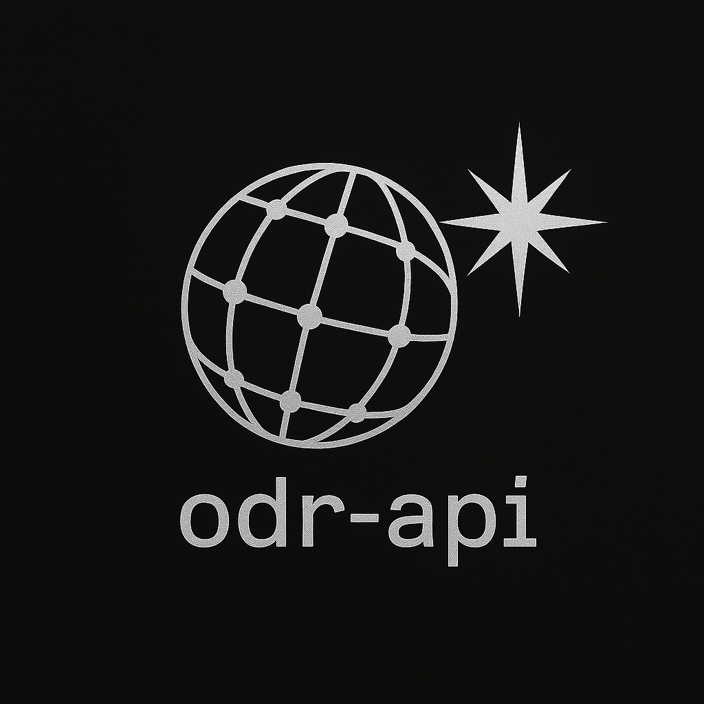

# Open Deep Research API


<a href="https://github.com/unclecode/crawl4ai">
  
</a>
<!-- Add other badges here later, e.g., Build Status, License, PyPI version -->

<p align="center">
  
</p>

**Developed by [Luminary AI Solutions LLC](https://luminarysolutions.ai)**

The Open Deep Research API provides a powerful, multi-step reasoning agent designed to perform in-depth research on complex queries. It leverages multiple Large Language Models (LLMs), web search, content scraping, and ranking techniques to generate comprehensive, cited reports streamed over WebSockets.

## ✨ Features

*   **Multi-Step Agent Workflow:** Orchestrates planning, searching, scraping, summarizing, chunking, writing, and refining steps.
*   **LLM Integration via LiteLLM:** Supports various LLM providers (OpenAI, Google Gemini, OpenRouter, etc.) through [LiteLLM](https://github.com/BerriAI/litellm) for planning, summarization, writing, and refinement.
*   **Web Search:** Integrates with [Serper](https://serper.dev/) for efficient and targeted web searches.
*   **Advanced Content Scraping:** Uses [Crawl4AI](https://github.com/extractus/crawl4ai) for robust web scraping and Markdown conversion, augmented by specialized utilities (e.g., for PDFs, Wikipedia) in `app/services/scraping_utils/`.
*   **Content Reranking:** Employs reranking models (via Together AI API) to prioritize the most relevant search results and text chunks.
*   **Structured & Robust:** Leverages [Pydantic](https://docs.pydantic.dev/) extensively for data validation (API requests/responses, LLM outputs) and internal data structuring, ensuring reliability.
*   **Asynchronous Streaming:** Provides real-time progress updates and the final report via a WebSocket endpoint (`/ws/research`).
*   **Configurable:** Allows overriding default LLM models, API keys, and certain workflow parameters via environment variables and request payloads.

## ⚙️ Agent Workflow

The core research process involves several orchestrated steps:

1.  **Planning:**
    *   Input: User Query
    *   Action: A Planner LLM generates a `WritingPlan` (defining report structure) and a list of `SearchTask` objects based on the query.
    *   Output: Validated `PlannerOutput` Pydantic model.

2.  **Initial Search:**
    *   Input: `SearchTask` list from the Planner.
    *   Action: Executes parallel searches using the Serper API.
    *   Output: List of `SearchResult` objects.

3.  **Reranking:**
    *   Input: `SearchResult` list, User Query.
    *   Action: Deduplicates results and reranks them using a relevance model (Together AI API). Splits results into high-relevance sources for summarization and lower-relevance sources for chunking.
    *   Output: Two lists of `SearchResult` objects (`sources_to_summarize`, `sources_to_chunk`).

4.  **Content Processing:**
    *   Input: `sources_to_summarize`, `sources_to_chunk`, User Query.
    *   Action:
        *   For `sources_to_summarize`: Scrapes content (using Crawl4AI and `scraping_utils`), then uses a Summarizer LLM to generate concise summaries relevant to the query.
        *   For `sources_to_chunk`: Scrapes content, divides it into `Chunk`s, and reranks the chunks for relevance against the query.
    *   Output: List of `SourceSummary` objects and list of relevant `Chunk` objects.

5.  **Context Assembly:**
    *   Input: `SourceSummary` list, `Chunk` list.
    *   Action: Combines summaries and relevant chunks into a ranked list to provide context for the writer. Assigns citation ranks.
    *   Output: Ranked list of context items (dictionaries).

6.  **Initial Writing:**
    *   Input: User Query, `WritingPlan`, Ranked Context Items.
    *   Action: A Writer LLM generates the initial draft of the report based on the plan and provided context, incorporating citation markers `[N]`.
    *   Output: Initial report draft (string).

7.  **Refinement Loop (Iterative):**
    *   Input: Current Draft, User Query, Writing Plan, Full List of Processed Source Materials (Summaries/Chunks).
    *   Action:
        *   Checks the draft for `<search_request query='...'>` tags indicating missing information.
        *   If found: Executes a new search, processes new relevant sources (scraping, chunking, reranking), and adds the resulting relevant chunks to the full list of source materials, assigning new citation ranks.
        *   Calls the **Writer LLM again** (using `get_writer_refinement_prompt`), providing the previous draft, the search query topic, and the **updated full list of source materials** with consistent citation markers. This call may use a different LLM configuration (e.g., the faster/cheaper summarizer model config) for efficiency.
        *   Repeats up to a configured maximum number of iterations or until no search tags are found.
    *   Output: Refined report draft (string), Updated Full List of Source Materials.

8.  **Final Assembly:**
    *   Input: Final Draft, Final Full List of Source Materials.
    *   Action: Removes any remaining search tags and appends a "References" section based on the citation markers `[N]` found in the draft and the corresponding source links from the final context.
    *   Output: Final report string with references.

9.  **Response:**
    *   Action: Sends the final report and detailed `UsageStatistics` (token counts, costs, API calls) via the WebSocket.

## 🛠️ Technology Stack

*   **Framework:** [FastAPI](https://fastapi.tiangolo.com/)
*   **Data Validation:** [Pydantic](https://docs.pydantic.dev/) V2
*   **LLM Orchestration:** Custom Agent Logic
*   **LLM Interaction:** [LiteLLM](https://github.com/BerriAI/litellm)
*   **Web Scraping:** [Crawl4AI](https://github.com/extractus/crawl4ai)
*   **PDF Parsing:** [MarkItDown](https://github.com/microsoft/markitdown) (via Crawl4AI or directly)
*   **Web Search:** [Serper API](https://serper.dev/)
*   **Reranking:** [Together AI API](https://www.together.ai/)
*   **Language:** Python 3.10+
*   **Async:** `asyncio`

## 💪 Robustness through Pydantic

Pydantic plays a critical role in ensuring the API's reliability:

*   **API Layer:** Validates incoming requests (`ResearchRequest`) and outgoing responses (`ResearchResponse`), ensuring adherence to the defined schema.
*   **LLM Interaction:** Structures prompts and validates the *output* of LLM calls (e.g., `PlannerOutput` from the Planner LLM), catching formatting errors or unexpected responses early. LiteLLM's `response_model` parameter is used for direct parsing and validation.
*   **Internal Data Flow:** Defines clear data structures (`SearchResult`, `Chunk`, `SourceSummary`, `UsageStatistics`, etc.) used throughout the agent's workflow, reducing errors caused by inconsistent data handling.

## 🧬 PydanticAI Integration (Development)

[PydanticAI](https://github.com/jxnl/pydanticai) (or similar structured output libraries) influences our development process, particularly in designing prompts and validation schemas for LLM interactions. While not a direct runtime dependency for the core agent logic *currently*, the principles of structured prompting and output validation are key to the development and testing pipeline, aiming for more reliable LLM integrations.

## 🚀 Installation

1.  **Clone the repository:**
    ```bash
    git clone https://github.com/YOUR_USERNAME/odr-api.git # Replace with actual repo URL
    cd odr-api
    ```
2.  **Create and activate a virtual environment:**
    ```bash
    python -m venv venv
    source venv/bin/activate  # On Windows use `venv\Scripts\activate`
    ```
3.  **Install dependencies:**
    ```bash
    pip install -r requirements.txt
    ```

## 🔧 Configuration

The API relies on environment variables for configuration, particularly API keys.

1.  Create a `.env` file in the project root directory.
2.  Copy the contents of `.env.example` (you should create this file) into `.env`.
3.  Fill in the required API keys and adjust any other settings:

    ```dotenv
    # .env Example
    LOG_LEVEL=INFO

    # Serper API Key (Required for search)
    SERPER_API_KEY="your_serper_api_key"

    # Together AI API Key (Required for reranking)
    TOGETHER_API_KEY="your_together_api_key"

    # LLM API Keys (Provide keys for the providers you intend to use)
    OPENAI_API_KEY="your_openai_api_key"
    GOOGLE_API_KEY="your_google_api_key" # For Gemini
    OPENROUTER_API_KEY="your_openrouter_api_key"

    # Optional: Override default models (defaults are in core/config.py)
    # DEFAULT_PLANNER_MODEL="openai/gpt-4o-mini"
    # DEFAULT_SUMMARIZER_MODEL="openai/gpt-4o-mini"
    # DEFAULT_WRITER_MODEL="openai/gpt-4o"
    # DEFAULT_RERANKER_MODEL="mixedbread-ai/mxbai-rerank-xsmall-v1"
    # DEFAULT_LLM_PROVIDER="openai" # or 'google', 'openrouter'

    # Optional: Specify OpenRouter base URLs if needed
    # OPENROUTER_API_BASE="https://openrouter.ai/api/v1"

    # Scraper settings
    # SCRAPER_DOWNLOAD_PDFS=false
    # SCRAPER_PDF_SAVE_DIR="./downloaded_pdfs"
    # SCRAPER_MAX_PDF_SIZE_MB=50

    # Other settings from AppSettings in core/config.py can be overridden here
    ```

## ▶️ Usage

1.  **Run the FastAPI server:**
    ```bash
    uvicorn app.main:app --reload --port 8000
    ```
    The API will be available at `http://localhost:8000`.

2.  **Interact via WebSocket:**
    *   The primary endpoint is `/ws/research`.
    *   Connect using a WebSocket client (see `websocket_client.py` for an example).
    *   Send an initial JSON message matching the `ResearchRequest` schema:
        ```json
        {
          "query": "Your research query here",
          "planner_llm_config": null, // Optional override
          "summarizer_llm_config": null, // Optional override
          "writer_llm_config": null, // Optional override
          "max_search_tasks": null, // Optional override
          "llm_provider": null // Optional override ('google', 'openrouter', etc.)
        }
        ```
    *   Receive JSON status updates:
        ```json
        {
          "step": "STEP_NAME", // e.g., "PLANNING", "SEARCHING", "PROCESSING", "WRITING", "REFINING", "COMPLETE", "ERROR"
          "status": "STATUS", // e.g., "START", "IN_PROGRESS", "END", "SUCCESS", "ERROR", "WARNING"
          "message": "Human-readable status message",
          "details": { ... } // Optional dictionary with extra context
        }
        ```
    *   The final message will have `step: "COMPLETE"` (or `step: "ERROR"`) and include the full report and usage statistics in the `details` field upon success.

3.  **Deprecated Endpoint:**
    *   The synchronous endpoint `/research` (POST) is deprecated and will return an error message directing you to use `/ws/research`.

## 🤝 Contributing

Contributions are highly welcome! This project aims to be a robust, community-driven tool for deep research.

**Areas for Contribution:**

*   **Specialized Scrapers:** Adding more robust scrapers for specific high-value websites (e.g., ArXiv, PubMed, specific news sites, documentation portals) in the `app/services/scraping_utils/` directory is highly encouraged!
*   **Agent Enhancements:** Improving planning logic, refinement strategies, or context management.
*   **LLM Support:** Adding configurations or improving compatibility with more LLM providers via LiteLLM.
*   **Error Handling:** Refining exception handling and reporting.
*   **Testing:** Adding more comprehensive unit and integration tests.
*   **Documentation:** Improving this README, adding architecture diagrams, or API documentation.

**How to Contribute:**

1.  Fork the repository.
2.  Create a new branch (`git checkout -b feature/your-feature-name`).
3.  Make your changes.
4.  Add tests for your changes.
5.  Ensure code passes linting and formatting checks (e.g., using Ruff/Black).
6.  Commit your changes (`git commit -m 'Add some feature'`).
7.  Push to the branch (`git push origin feature/your-feature-name`).
8.  Open a Pull Request.

Please review the `CONTRIBUTING.md` (if available) for more detailed guidelines.

## 📜 Citation

This project builds upon concepts and architectures explored in academic research. If you use or extend this work, please consider citing the relevant papers, including:

```bibtex
@misc{alzubi2025opendeepsearchdemocratizing,
      title={Open Deep Search: Democratizing Search with Open-source Reasoning Agents},
      author={Salaheddin Alzubi and Creston Brooks and Purva Chiniya and Edoardo Contente and Chiara von Gerlach and Lucas Irwin and Yihan Jiang and Arda Kaz and Windsor Nguyen and Sewoong Oh and Himanshu Tyagi and Pramod Viswanath},
      year={2025},
      eprint={2503.20201},
      archivePrefix={arXiv},
      primaryClass={cs.LG},
      url={https://arxiv.org/abs/2503.20201},
}
```

## 📄 License

This project is licensed under the MIT License - see the [LICENSE](LICENSE) file for details.

## 📧 Contact

Luminary AI Solutions LLC - [info@luminarysolutions.ai](mailto:info@luminarysolutions.ai) - [luminarysolutions.ai](https://luminarysolutions.ai) 